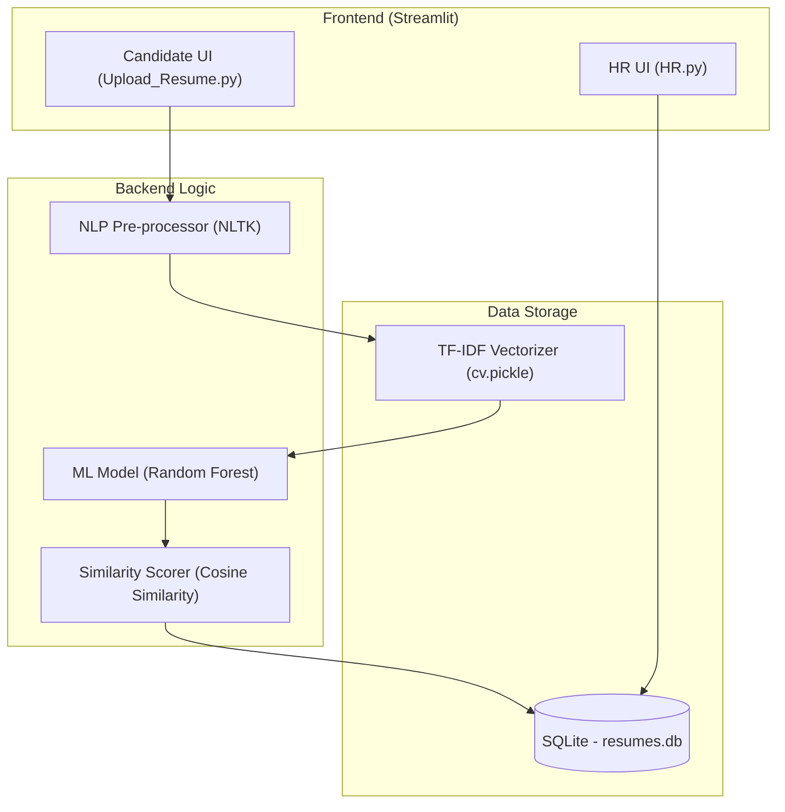

# AI Resume Screening: Semester Project Presentation Guide

This guide provides the structure and content for your presentation, ensuring you meet all the requirements specified by your professor.

---

## 1. System Architecture
Explain how different components of your project interact. Your architecture is a **Client-Server-Model** pattern.

**Key Points to Explain:**
- **Frontend:** Built with Streamlit for a fast, responsive web interface.
- **Processing Layer:** Uses NLTK for cleaning raw text from PDFs/Docs.
- **Model Layer:** Combines a Random Forest Classifier with Cosine Similarity for multi-dimensional scoring.
- **Persistence:** SQLite handles data storage, making the system lightweight and portable.

---

## 2. Modules Implemented
List the functional blocks you have built:

1.  **HR Requirement Module (`HR.py`):** Allows HR to set the hiring target. We recently updated this to fetch positions dynamically from the database.
2.  **Resume Parsing Module (`Upload_Resume.py`):** Handles PDF, DOCX, and TXT using `PyPDF2` and `docx2txt`.
3.  **NLP Cleaning Module:** A dedicated function that removes stopwords, special characters, and normalizes text for the AI.
4.  **AI Scorer Module:** Calculates a "Total Score" based on three factors:
    - **Keyword Match:** Direct skill extraction.
    - **Classification Confidence:** Probability from the Random Forest model.
    - **Semantic Fit:** Mathematical similarity between job description and resume.
5.  **Database Module (`init_sqlite.py`):** Manages relations between HR requirements, skills, and shortlisted candidates.

---

## 3. Workflow & Project Flow
How the data moves from a raw file to a "Shortlisted" status.

1.  **Initialization:** Database tables and initial skills are seeded.
2.  **HR Setup:** HR selects a position (e.g., Python Developer) and minimum experience.
3.  **Candidate Submission:** Candidate enters details and uploads a resume.
4.  **Transformation:** Resume is converted to a TF-IDF vector (numerical format).
5.  **Prediction:** The Random Forest model predicts if the resume belongs to the HR-selected category.
6.  **Decision:** 
    - *If category matches:* Calculate total score and save to database.
    - *If no match:* Notify candidate and discard (or save as "Potential" for other roles).

---

## 4. Progress Achieved (Dataset & Training)
Show that you actually trained a model, not just theoretical ideas.

-   **Datasets Used:** Trained on thousands of resumes from Kaggle (Gaurav Dutt & Snehaan Bhawal datasets).
-   **Methodology:** 
    - Pre-processed 25+ categories of resumes.
    - Used **TF-IDF Vectorization** (N-grams) to capture technical context.
    - Tested multiple algorithms (SVM, KNN, Random Forest).
-   **Results:** The **Random Forest** algorithm was chosen for its high accuracy (approx. 91% baseline) and ability to handle high-dimensional text data without overfitting.
-   **Deployment:** The trained model is serialized into `RF.joblib`, allowing it to predict in real-time (< 5 seconds per resume).

---

## 5. Demonstration Strategy (Visuals)
During the live demo, show these three screens:
1.  **HR Screen:** Show the dropdown (which we restricted to defined skills). Set a requirement.
2.  **Upload Screen:** Upload a sample resume. Point out the "Classification Confidence" and "Similarity Match" metrics on the screen—professors love these numbers!
3.  **Results Table:** Go back to the HR screen, click "Show Resumes," and show the candidate perfectly sorted by score.

---

### Tips for "Explaining Carefully":
- **Why Random Forest?** Explain it's an ensemble of decision trees, which makes it stable for text classification.
- **Why Cosine Similarity?** Explain that searching for exact keywords isn't enough; similarity measures the "vibe" or context of the resume.
- **Why SQLite?** Explain it's a "Zero-Configuration" database, perfect for this application's scale.
