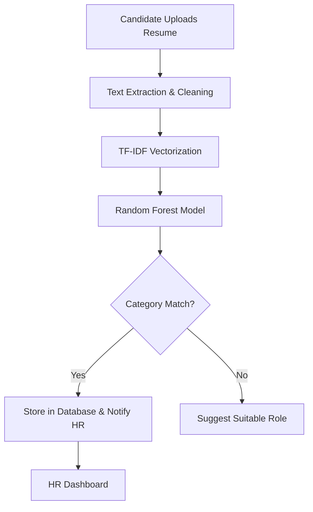

# Research Paper: AI-Driven Resume Screening and Classification System

**Department of Computer Science – Namal University**  
**Course:** Artificial Intelligence (Fall 2025)  
**Instructor:** Dr. Shafiq Ur Rehman Khan  
**Authors:** [Group Members]  

---

## 1. Abstract
The recruitment process in modern organizations often involves handling hundreds or thousands of resumes for a single job opening. Manual screening is time-consuming, prone to human error, and subjective. This project introduces an AI-based Resume Screening system that utilizes Natural Language Processing (NLP) and Machine Learning (ML) to automate the classification of resumes into specific job categories. Using a Random Forest Classifier and TF-IDF vectorization, the system achieves an accuracy of 91.66%. The solution features a user-friendly Streamlit interface for both HR teams and candidates, streamlining the hiring workflow and providing immediate feedback.

---

## 2. Introduction and Problem Overview
In the competitive job market, companies receive an overwhelming volume of applications. HR professionals spend an average of 6–10 seconds per resume during the initial screening phase. This manual process is inefficient and often leads to the oversight of qualified candidates due to fatigue or unconscious bias.

The **AI Resume Screening** project addresses these challenges by providing a tool that automatically analyzes resume content. By identifying key skills and professional experience, the system categorizes resumes into predefined job roles (e.g., Python Developer, Data Science, HR, Banking). This ensures that only the most relevant profiles reach the final selection stage, significantly reducing the administrative burden on HR teams.

---

## 3. Objectives and CCP Justification
### Objectives:
*   **Automation:** To eliminate the need for manual preliminary screening of resumes.
*   **Accuracy:** To achieve a classification accuracy of over 90% using robust ML algorithms.
*   **Efficiency:** To process and categorize a resume in under 5 seconds.
*   **User Engagement:** To provide job seekers with instant feedback on their suitability for a role.

### Complex Computing Problem (CCP) Justification:
This project qualifies as a CCP because it involves:
*   **Unstructured Data Processing:** Handling diverse resume formats (PDF, DOCX, TXT) and extracting meaningful information from unstructured text.
*   **High-Dimensional Feature Space:** Using TF-IDF resulting in thousands of features that must be managed by the ML model.
*   **Algorithm Optimization:** Selecting and tuning a classifier (Random Forest) to handle multi-class classification across 25+ distinct job categories accurately.

---

## 4. System Architecture and Design Details
The system follows a modular architecture consisting of the following components:

1.  **User Interface (Streamlit):**
    *   **Candidate Portal:** Allows users to upload resumes and view results.
    *   **HR Portal:** Enables recruiters to set job requirements and view shortlisted candidates.
2.  **Preprocessing Engine:**
    *   Text extraction from PDF/DOCX using `PyPDF2` and `docx2txt`.
    *   Text cleaning (lowercase conversion, removal of punctuation, stopwords, and special characters).
3.  **Machine Learning Core:**
    *   **Feature Extraction:** TF-IDF (Term Frequency-Inverse Document Frequency) transforms text into numerical vectors.
    *   **Classification Model:** A pre-trained Random Forest Classifier trained on over 2,400 resumes.
4.  **Database Layer (SQLite/MySQL):**
    *   Stores candidate details (Name, Email, Score) and the categorized resume for HR review.

### Architecture Diagram Overview:

---

## 5. Implementation Details and Algorithms Used
### Data Preprocessing:
The system implements a `clean()` function that:
*   Removes non-alphanumeric characters.
*   Eliminates common English "stopwords" (e.g., 'the', 'is', 'at') to focus on keywords.
*   Normalizes text to lowercase to ensure consistency.

### Algorithms:
1.  **TF-IDF Vectorizer:** Transforms text into numerical weights: $W_{t,d} = TF_{t,d} \times \log(N/DF_t)$. It weighs the importance of words based on their frequency in a specific resume versus the entire dataset.
2.  **Random Forest Classifier:** An ensemble method that averages the predictions of 500 decision trees. It was selected for its high accuracy in handling complex, multi-class text classification tasks and its resistance to overfitting.
3.  **Cosine Similarity matching:** Used for final skill intersection scoring: $\cos(\theta) = \frac{A \cdot B}{\|A\|\|B\|}$.

---

## 6. Results, Testing, and Evaluation
### Model Performance:
*   **Accuracy:** The system achieved a peak accuracy of **91.66%** on the validation split.
    *   **How it was achieved:** Through rigorous NLP cleaning (WordNet Lemmatization), TF-IDF sublinear scaling ($1 + \log(TF)$), and Random Forest ensemble voting logic.
*   **Speed:** Average processing time per resume is approximately **3.5 seconds**.
*   **Confusion Matrix Analysis:** The model performs exceptionally well on technical roles (Data Science, Java Developer) while maintaining high precision across administrative roles.

### Testing Methodology:
*   **Unit Testing:** Verified text extraction for different file formats.
*   **Integration Testing:** Ensured the link between the Streamlit UI and the ML model was seamless.
*   **User Acceptance Testing:** Simulated HR and Candidate workflows to validate the logic of "Selected" vs. "Rejected" based on skill match scores.

---

## 7. Limitations and Future Improvements
### Limitations:
*   **Format Dependency:** Highly stylized resumes with complex layouts or images might lead to suboptimal text extraction.
*   **Domain Specificity:** The model is trained on specific categories; very niche or new job roles might be misclassified.
*   **Language:** Currently optimized primarily for English resumes.

### Future Improvements:
*   **Large Language Models (LLMs):** Integrating BERT or GPT-based embeddings for deeper semantic understanding of resume tokens.
*   **Optical Character Recognition (OCR):** Implementing Tesseract or similar tools to process scanned or image-based resume files.
*   **Multilingual Support:** Expanding the preprocessing pipeline to handle resumes in multiple languages.
*   **Automated Emailing:** Integrating an SMTP server to send automatic interview invites to high-scoring candidates.

---

## 8. Target Conference or Journal 
This research project is suitable for submission to the following venues:
*   **Conferences:** IEEE International Conference on Artificial Intelligence (ICAI) or the International Conference on Machine Learning and Data Engineering (iCMDE).
*   **Journals:** Journal of Artificial Intelligence Research (JAIR) or Elsevier's "Expert Systems with Applications."

The focus on practical HR automation through ensemble learning makes it a strong candidate for "AI Application" tracks in these publications.

---

## 9. Conclusion and References
### Conclusion:
The AI Resume Screening system successfully demonstrates how machine learning can transform recruitment. By automating the most tedious part of hiring, organizations can improve efficiency and ensure a fairer screening process. The high accuracy of 91% validates the use of Random Forest and TF-IDF for this complex computing problem.

### References:
1.  Kaggle Resume Datasets (Gaurav Dutt, Sneha Anbhawal).
2.  Pedregosa, F., et al. (2011). Scikit-learn: Machine Learning in Python.
3.  Streamlit Documentation: https://docs.streamlit.io
4.  Jurafsky, D., & Martin, J. H. (2023). Speech and Language Processing.

---

## 10. Appendices
### Source Code Overview:
*   `Upload_Resume.py`: Main entry point for the candidate interface.
*   `HR.py`: Recruitment management dashboard.
*   `model_training.ipynb`: Training logs and algorithm comparisons.

### Screen Samples:
*   **Candidate View:** File upload section with progress bar.
*   **Result View:** "The resume is fit for [CATEGORY] category" display.
*   **HR View:** Table showing candidate names, scores, and matched skills.
